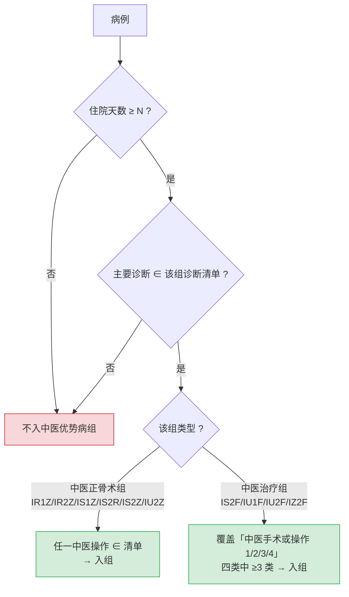

> 相关文档：需求汇总见《需求规格说明书》§3.2；功能汇总见《产品功能手册》§2；总索引见 README.md

# 中医优势病组规则提取与回测验证（一期 S04 / S05）

> 执行日期：2026-09-20
> 政策依据：**某地区医保局〔2025〕27 号**《某地区基本医疗保险按病组（DRG）中医优势病种付费（2025 年版）》
> policy_version：`某地区医保局〔2025〕27号-2025版`
> 回测集：2026-03~05 官方结算返回 **N 例**
> 可复现产物：`src/etl/s04_extract_tcm_rules.py`、`src/etl/s05_validate_tcm_rules.py`、
> `src/out/tcm/tcm_advantage_rules.csv`（379 条规则）、`tcm_predictions.csv`、两份报告
>
> **结论：自建中医优势病组规则与官方结算判定一致率 99.8%（404/405）；同一批病例，既有引擎识别率为 0%。**

---

## 一、官方入组规则（从 27 号文附件 2 原文提取）

附件 2《中医优势病组主要诊断及中医主要手术或操作表》共 **10 个中医 DRG 病组**，
入组条件实测为**两套语义**：

| # | DRG | 组名 | 住院天数≥ | 主要诊断 | 中医操作 | 入组条件 |
|---:|---|---|---:|---:|---:|---|
| 1 | IR1Z | 骨盆骨折，中医正骨术 | 10 | 6 | 3 | 交集 |
| 2 | IR2Z | 股骨骨折，粗隆间骨折中医正骨术 | 20 | 4 | 1 | 交集 |
| 3 | IS1Z | 前臂、腕、手或足损伤，中医正骨术 | 10 | 37 | 11 | 交集 |
| 4 | IS2R | 除前臂、腕、手足外的损伤，肱骨干骨折中医正骨术 | 12 | 13 | 3 | 交集 |
| 5 | IS2Z | 除前臂、腕、手足外的损伤，中医正骨术 | 12 | 79 | 18 | 交集 |
| 6 | IS2F | 除前臂、腕、手足外的损伤，膝痹中医治疗 | 10 | 7 | 35（4 类） | **组合 ≥3 类** |
| 7 | IU1F | 骨病及其他关节病，骨痹中医治疗 | 10 | 6 | 35（4 类） | **组合 ≥3 类** |
| 8 | **IU2F** | **颈腰背疾患，项腰痹中医治疗** | 10 | 13 | 42（4 类） | **组合 ≥3 类** |
| 9 | IU2Z | 颈腰背疾病，胸腰椎骨折中医正骨术 | 10 | 20 | 2 | 交集 |
| 10 | IZ2F | 骨骼、肌肉、肌腱、结缔组织的其他疾病，肩痹中医治疗 | 12 | 9 | 35（4 类） | **组合 ≥3 类** |

**"组合 ≥3 类"是本次最关键的规则发现**：以 IU2F 为例，官方原文列出"入组条件 1~5"，
即"操作类 1+2+3"/"1+2+4"/"2+3+4"/"1+3+4"/"1+2+3+4"——恰为 4 类中任取 3 类与其全取，
**等价于"四类中医操作（推拿类 / 针法类 / 灸法类 / 敷贴薰洗类）中至少覆盖 3 类"**。

> 也就是说，IU2F 的真实入组条件**不是"做了一个毫针或推拿"**，而是必须同时具备至少三类中医操作。
> 这条规则此前在院内资料中完全缺失。

---

## 二、手工转录件核对结论（P0 交付物）

`原始资料/中医入组标准(1).xlsx` 为手工转录件，方案要求"未与官方原文逐条核对不得入引擎"。核对发现 **3 类缺陷**：

| # | 缺陷 | 性质 | 后果 |
|---|---|---|---|
| 1 | 把「诊断清单 × 操作清单」**按行拍平**成一行一配对 | 结构性 | 官方是两清单取交集（如 IS1Z = 37 诊断 × 11 操作），按转录件会大量误判"不满足入组" |
| 2 | 中医治疗组**只转录了「操作 1」**，丢失操作 2/3/4 | 完整性 | IS2F/IU1F/IU2F/IZ2F 各少 18~31 项操作；**入组判定必错** |
| 3 | 文字与数字错误：`骼骨骨折`（应 `髂骨骨折`）、IS2Z 标准费用 `9380.70`（应 `9380.07`，数字转置） | 准确性 | 结算参数与诊断匹配错误 |

> **反向验证**：转录件唯一"对"的地方是「标准费用」——10 个组的费用与
> `官方二三级权重 × 9,575.25 × 0.92` **逐一吻合（差 ≤0.01 元，IS2Z 除外即缺陷 3）**。
> 由于算式两边来源完全独立（左＝政策附件，右＝细分组目录 + N 例实测反推系数），
> 这等价于对 **费率 9,575.25**、**机构系数 0.92**、**二三级机构口径** 做了一次交叉验证。

---

## 三、编码映射打通（并修正一处旧判断）

### 3.1 新旧两套中医操作编码

| 体系 | 编码示例 | 出处 |
|---|---|---|
| 院内 / 国临版（HIS `源表(operation).列(code)`） | `99.9201` 毫针刺法、`93.3512` 隔物灸、`99.9203` 电针经络氧疗法 | HIS 生产数据 |
| 医保版 2025（27 号文与官方结算返回） | `17.91100` 毫针治疗、`17.91320` 隔物灸治疗、`17.912A0` 电针治疗 | 政策与结算 |

**映射表已存在且完全可用**：`原始资料/数据字典/本地对照表.csv`（`列(kind)='S'`，13,734 条），
窗口内 56 个院内手术码 **100% 命中**。

### 3.2 对 docs/05 判断的修正（审计留痕）

| 项 | docs/05 原判断 | 实测修正 |
|---|---|---|
| IU25↔IU2F 分歧主因 | "中医操作主次顺序决定入组"（电针 `99.9200x016` vs 毫针 `17.91100`） | **实为新旧编码体系不同**（院内 `99.9200x016` ↔ 医保 `17.912A0`，同为"电针"）；"主次顺序"只是表象 |
| 既有引擎问题定性 | "规则缺失" | 更准确：**规则缺失 + 编码体系未对齐**，两者叠加 |

---

## 四、回测验证结果（S05）

用自建规则对 N 例独立重算，与官方结算结果逐例比对：

| 指标 | 数值 |
|---|---:|
| 官方判为中医优势病组（F/R/Z 结尾） | **405**（73.4%） |
| 规则重算判为中医优势病组 | **405**（73.4%） |
| 两者一致 | **404** |
| **召回率**（官方中医组中被正确识别） | **99.8%** |
| **精确率**（重算中医组中官方也认可） | **99.8%** |
| 对比：既有引擎识别率（S02 实测） | **0.0%** |

### 分组级命中明细

| 中医组 | 官方例数 | 重算例数 | 精确命中 | 一致 |
|---|---:|---:|---:|:--:|
| IR2Z | 1 | 1 | 1 | ✓ |
| IS1Z | 33 | 33 | 33 | ✓ |
| IS2R | 9 | 10 | 9 | △（1 例误判） |
| IS2Z | 13 | 13 | 13 | ✓ |
| IU1F | 62 | 62 | 62 | ✓ |
| **IU2F** | **261** | 260 | 260 | ✓（1 例漏判） |
| IU2Z | 1 | 1 | 1 | ✓ |
| IZ2F | 25 | 25 | 25 | ✓ |

剩余 2 例偏差：① 漏判 1 例（官方 IU2F，主诊断 `M50.101+G55.1*` 为带星号复合编码）；
② 误判 1 例（官方 ZZ13 多发性重要创伤，重算 IS2R）。两者均为**边界个案**，列入迭代清单。

---

## 五、新发现的结算前置条件：中治率 ≥ 60%

27 号文"二·结算清算"规定（**此前方案未纳入**）：

> 入组「中医优势病组」的住院病例，按相应入组权重进行月结算。……月度结算或年度清算时依据
> 「中治率」≥60% 进行考核，对「中治率」＜60% 的病例，按相应 ADRG 内科 DRG 病组
> （区分严重程度分组的，按伴一般合并症或并发症组）权重标准进行清算。

> 中治率 =（中医治疗费 + 中成药费 + 中药饮片费）/（中医治疗费 + 西医治疗费 + 西药费 + 中成药费 + 中药饮片费 + 手术费 + 卫生材料费）× 100%

**财务影响量化（IU2F）**：达标权重 0.9258 → 支付标准 **8,155.59 元**；
未达标降级为 IU23（0.6524）→ **5,747.14 元**；**单例差额 2,408.44 元**。
按回测期 261 例 / 3 个月 ≈ 87 例/月估算，**月度收入影响约 21.0 万元**。

**落地要求**：
1. 中治率作为**与入组并列的预结算前置指标**，在在院模拟器中实时提示；
2. 费用三表 `列(sort_code)` 统计码与中治率六个科目逐项对齐；
3. 作为「政策硬条件」纳入白名单，挂 27 号文条款出处，交医务科 + 信息科双主管审议签认。

---

## 六、对总体方案（docs/08 v1.3）的修订建议

| # | 修订项 |
|---|---|
| 1 | 二期"引擎 v1"的**中医优势病组部分已提前完成并通过回测**，可直接作为规则函数交付（`usp_DrgGroup_TcmAdvantage`） |
| 2 | 影子运行的分层 KPI 加入：**中医优势病组识别召回率/精确率**（当前基线 99.8% / 99.8%） |
| 3 | 中治率纳入一期的质控清单与在院模拟器（见 §五） |
| 4 | 编码映射列为**一期必备组件**（`国临版对照医保版` 表 + 归一化规则：大小写 `X/x`、复合码 `+...*`） |
| 5 | 规则入库时对官方 PDF 的**非规范写法**做容错（同类表头有三种写法、编码大小写混用），并把容错规则写入提取脚本注释 |
| 6 | 转运维：`policy_version` 已落地到规则表每行，政策更新可整体替换并回归 |

---

## 七、下一步

1. **S06 在院 DRG 模拟器 v0**：把「入组判定 + 中治率 + 费用预判」合并为住院医师视图的四行输出；
2. 解析附件 1（23 病种 ↔ 10 病组）、附件 4/5（12 个中医特色病种 + 倾斜比例 + 绩效考核指标），补全规则库；
3. 规则表提交医务科主管 + 信息科主管审议签认；
4. 纳入 §四 剩余的 2 例边界个案，逐例人工复核后归档。

---

## 附：本次沉淀的资产

| 资产 | 路径 |
|---|---|
| 规则提取作业 | `src/etl/s04_extract_tcm_rules.py` |
| 规则表（379 条，含 policy_version） | `src/out/tcm/tcm_advantage_rules.csv` |
| 结构化规则（含组合条件、操作分类） | `src/out/tcm/tcm_advantage_rules.json` |
| 官方 PDF 全文（70 页，含附件 1~5） | `src/out/tcm/中医优势病种付费2025_原文.txt` |
| 回测验证作业 | `src/etl/s05_validate_tcm_rules.py` |
| 逐例预测明细 | `src/out/tcm/tcm_predictions.csv` |
