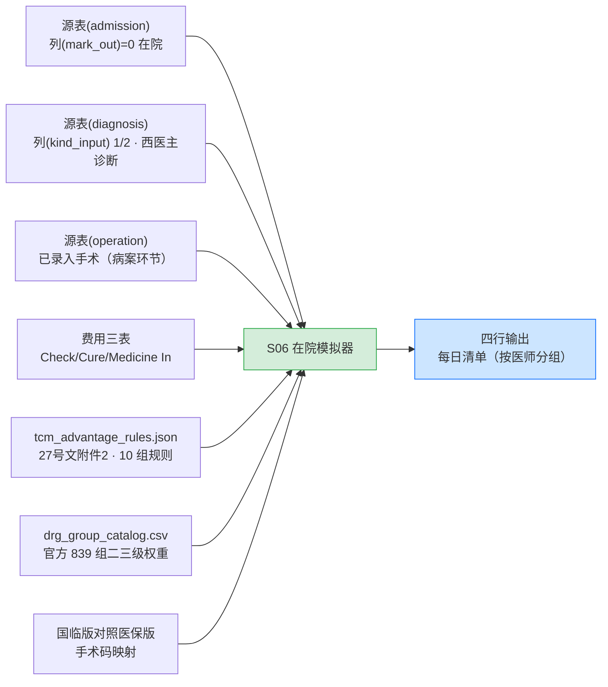

> 相关文档：需求汇总见《需求规格说明书》§3.3；功能汇总见《产品功能手册》§3；总索引见 README.md

# 在院 DRG 模拟器 v0（一期 S06 · 使用方一号需求）

> 交付日期：2026-09-20
> 用户：**住院医师**（经管医师）
> 交付形态：内网 Python 作业 + 每日清单（不嵌 HIS，既有系统已退出）；后续挂 Metabase 看板
> 可复现产物：`src/etl/s06_insim.py`、`src/out/insim/insim_<日期>.csv`、`s06_insim_<日期>.md`

---

## 一、产品定位

使用方原话需求是"让住院医师知道自己手底下在院患者用药费用是否达到 DRG 入组条件、是否为最佳入组"。
按 docs/10 的评估结论，这个诉求必须**拆成两个独立问题**分别回答：

| 使用方表述 | 实际是两个问题 | 由什么决定 |
|---|---|---|
| "是否达到入组条件" | **入组条件是否满足** | 主要诊断 + 中医操作类别覆盖 + 住院天数（**与用药费用无关**） |
| "是否最佳入组 / 利益最大化" | **费用与支付标准的关系** | 当前累计费用 vs 预计支付标准（**这才是"用药费用"维度**） |

因此工具输出固定为四行，缺一不可。

---

## 二、数据链路

**参数口径（均已实测验证）**：费率 `9,575.25`、机构系数 `0.92`、权重取官方目录**二三级医疗机构权重**列。

---

## 三、四行输出定义与实测样例

| 行 | 内容 | 计算依据 |
|---|---|---|
| ① 当前预分组 | 命中哪个中医优势病组 / 未命中则说明将入普通内科组 | `evaluate()` 执行 S04 规则表判定，输出组码 + 组名 + 权重 + 支付标准 |
| ② 入组差距 | **只对"主要诊断已命中该组清单"的病组**提示差距 | 诊断入清单 且 操作类覆盖不足 / 住院天数不足 |
| ③ 费用预判 | 累计费用 − 预计支付标准（预计盈亏 / 超支幅度） | 费用三表求和（`列(mark_dell)=0`） |
| ④ 优化空间 | **仅白名单内**：补录"已执行但未录入"的操作编码、复核主要诊断选择依据 | 黑名单（增src/延长住院/改诊断）永不生成 |

### 实测样例（2026-09-20，全院 120 例在院患者）

| 住院号 | 住院天数 | 主要诊断 | ① 预分组 | ② 入组差距 | ④ 优化空间 |
|---|---:|---|---|---|---|
| 20261445 | 17 | M17.900x004 左膝关节骨性关节病 | 未命中 | IU1F（骨痹中医治疗）：已覆盖中医操作类 无（0/3 类） | 若临床已执行但未录入，可补录「中医操作类 1,2,3,4」对应操作编码 |
| 20261507 | 8 | M51.202 腰椎间盘突出症 | 未命中 | IU2F（项腰痹中医治疗）：住院天数不足（当前 8 天，要求 ≥10 天） | 当前已满足诊断条件，差距在住院天数；**按临床规范执行，不做人为干预** |

> 样例 2 体现了合规护栏的设计意图：当唯一差距是"住院天数"时，工具**不给出任何延长住院的暗示**，
> 而是显式声明"不做人为干预"。

---

## 四、v0 实测暴露的数据缺口（本期最有价值的产出之一）

### 缺口 1｜在院「已执行中医操作」几乎无数据（**阻塞级**）

- 实测：全院 **120 例在院患者中，`源表(operation)` 仅 5 例有记录**；
- 原因：该表是**病案首页**的手术操作表，由编码员在**出院/病案环节**填写，住院期间基本为空；
- 后果：②入组差距目前只能基于「主要诊断 + 住院天数」可靠判定，**操作类覆盖在住院早期普遍为 0**，
  工具会提示"可补录"，但补录前提是"临床确实执行过"——v0 无法自动核实。
- 解决路径（需与使用方确认择一）：
  1. 接入**医嘱执行表**（下医嘱 + 执行确认），最贴近"已执行"语义；
  2. 建立**「收费项目 → 医保版手术操作码」对照**——注意费用表 `列(cost_no_medicare)`（如 `014300000040000`）
     是**医疗服务项目码**，不是 ICD-9-CM 手术操作码（如 `17.91100`），需重建对照；
  3. 二者都做：医嘱为"将执行"，费用为"已执行"，交叉校验。

> 该缺口同时是**三期"收费项目↔医保目录对照重建"的提前暴露**，建议优先级提前。

### 缺口 2｜中治率无法计算（**合规级**）

- 27 号文硬条件：中治率 ≥60%，否则中医组降级为内科组（IU2F→IU23，单例差 2,408 元，月度约 21 万元）；
- 实测阻塞：费用统计码 `列(sort_code)` 只能区分「治疗费(10)/手术费(11)/护理费(07)/床位费(05)/诊察费(06)…」，
  **无法区分中医 / 西医**；
- 中治率公式需六个科目（中医治疗费 / 中成药费 / 中药饮片费 / 西药费 / 西医治疗费 / 手术费 / 卫生材料费），
  必须从**收费项目属性**（收费项目主档 + 医保版目录）建立科目映射后才能计算。

### 缺口 3｜普通 ADRG 主分组与 CC/MCC 未接入

未命中中医优势病组时，只能提示"将入普通内科组"，给不出具体组码与支付标准。待二期引擎 v1 补齐。

### 缺口 4｜医师字段口径

`列(doctor_residency)` 实为 **`工号|姓名`** 格式（如 `51015|示例医师甲`），且存在空值。
上线前需与信息科确认工号口径与必填控制（对应 docs/08 §十二 医院配合事项）。

---

## 五、合规护栏（审计角色红线）

| 类别 | 内容 |
|---|---|
| **白名单**（允许输出） | 主要诊断/主要操作的正确选择与顺序提示、漏编中医操作与 CC/MCC 的补录提醒（限"已执行但未录入"）、中医病证规范填报 |
| **黑名单**（永不生成） | 建议增加诊疗项目、建议延长住院、建议改诊断以入更高权重组 |
| 全局声明 | 所有输出标注「基于当前已录入信息推演，分组结果以医保平台为准」 |
| 可追溯 | 每条规则挂政策出处（`policy_version=某地区医保局〔2025〕27号-2025版`），供医务科 + 信息科双主管审议 |

---

## 六、下一步

1. **打通在院操作数据源**（缺口 1）——v1 的关键前置，决定②③行的准确性；
2. 建立收费项目科目映射，接入**中治率**实时校验（缺口 2）；
3. 接入普通 ADRG 主分组 + CC/MCC（缺口 3，二期引擎 v1）；
4. 由信息科评估将每日清单推送到**企业微信/钉钉**的通道（告警通道一并确定，docs/08 §九）；
5. 上线前抽样核对 `列(doctor_residency)` 与临床实际管床的一致率。
