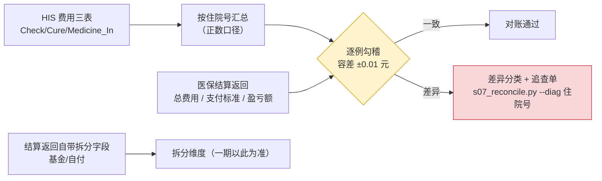

> 相关文档：需求汇总见《需求规格说明书》§3.4；功能汇总见《产品功能手册》§4、§5；总索引见 README.md

# 财务对账包 v1 与盈亏基线看板（一期 S07 / S08）

> 执行日期：2026-09-20
> 数据范围：2026-03~05 官方结算返回 **N 例**
> 可复现产物：`src/etl/s07_reconcile.py`、`src/etl/s08_pnl_board.py`、
> `src/out/recon/*`、`src/out/board/*`
>
> **本期两项口径定版**（此前从未确认，是财务对账与所有盈亏报表的前提）：
> ① 对账口径 = **费用明细中 `列(money) > 0` 的合计**（剔除退费/红冲负数行）；
> ② 官方盈亏额 = **DRG 支付标准 − 住院医疗总费用**（正数=医院盈利）。
>
> ④ **对账范围随结算返回推导 + 3–7 月重新基线化（2026-09-27）**：`s07` 取数窗口原硬编码
> 3–5 月（`2026-02-20 ~ 2026-06-01`），现由 `settlement_returns.csv` 的 `settle_date` 区间推导
> （当前 = 出院 2025-12-31 ~ 2026-08-31），否则 6–7 月病例对账取不到 HIS 源数据（与 s14 同类缺陷）。
> **已在生产库重跑并重新基线化（N 例）**：
>
> | 指标 | 3–7 月基线（N 例） |
> |---|---:|
> | 逐例一致率（净额口径） | **25.3%**（217/N） |
> | 全量差异合计（HIS 净额 − 官方） | **−72,945.63** 元 |
> | 含负数行（退费/红冲）病例 | **641** 例（**74.6%**），负数合计 **−73,511.34** 元 |
> | **正数口径一致率** | **99.4%**（正数口径差异 **565.71** 元） |
> | 差异分类 | 显著 >100 元 231 例（−58,142.78）／一致 217／小差 ≤100 元 406（−14,800.74）／微差 ≤1 元 5 |
> | 中治率（可比对 619 例） | ≥60% **617 例（99.7%）**、<60% **2 例**；中位数 **81.0%**、区间 58.4%~99.1% |
> | **回测期合计盈亏** | **672,050.33** 元 |
> | 月度盈亏 | 03 156,745.45（自算）／04 163,910.84／05 126,880.36／06 136,875.12／07 87,638.56 |
> | 盈亏数据来源 | 官方字段 **674** 例 + 自算 **185** 例（3 月返回无盈亏列） |
> | 病组 | **34** 个（其中中医优势病组 **9** 个） |
>
> **盈亏口径三列已随迁移 11 落库**（`result_pnl.profit_formula / profit_adjust / profit_basis`），
> 两条恒等式在生产库校验 **零漂移**：`profit_formula = std_cost − total_cost`、
> `profit_loss = profit_formula + profit_adjust`。
> 旧 3–5 月（N 例）数字仍为该子集的有效结论，引用须注明区间。
>
> ③ **盈亏口径显式化（2026-09-27，实装并回应 `docs/35` D5）**：官方盈亏字段对**高低倍率病例置 0**
> （某地区医保局〔2025〕26 号），故 `result_pnl` 聚合层的 `profit_loss` **本就不等于** `std_cost − total_cost`。
> 现同表携带 `profit_formula`（= 支付标准 − 总费用）、`profit_adjust`（= `profit_loss` − `profit_formula`）
> 与 `profit_basis`（口径来源），两条恒等式可作对账断言：`profit_formula = std_cost − total_cost`、
> `profit_loss = profit_formula + profit_adjust`。**分组盈亏排名用 `profit_loss`（官方口径）；费用结构/体量
> 分析用 `profit_formula`**——两者不可混用，混用会得出"同一张表两套规则"的误判。

---

## 一、S07 财务对账包 v1（使用方需求 4：对账口径明细、到笔）

### 1.1 勾稽设计

### 1.2 核心发现：差异不是数据缺失，而是**口径定义**

| 口径 | 逐例一致率 | 全量差异 |
|---|---:|---:|
| HIS 费用明细**净额**（含退费负数行） | **24.5%**（135/N） | −47,544.12 元 |
| HIS 费用明细**正数合计**（剔除负数行） | **99.5%**（549/N） | +439.60 元 |

- 含负数行（退费/红冲）的病例：**417 例（75.5%）**，负数金额合计 **−47,983.72 元**
- 负数集中在统计码 `10 治疗费`(−19,252.50)、`03`(−16,124.78)、`14`(−7,565.00)、`05 床位费`(−5,420.00)…

**结论**：官方「住院医疗总费用」按**正数合计**口径给出；HIS 明细中的退费/红冲行必须**单列为调整项**，
不能直接参与净额勾稽。此条即"能否对到笔"的前提。

> 追查工具：`python src/etl/s07_reconcile.py --diag <住院号>` 输出该例的科目级费用构成。

### 1.3 基金 / 自付拆分来源修正（推翻 docs/05 的判断）

| 候选数据源 | 实测结论 | 可用性 |
|---|---|---|
| `源表(settle_bill)` 四金额列（甲类/乙类/自付/其他） | 近一年半 **401,265 行填充率均为 0%** | **不可用** |
| `源表(invoice_title).列(hospital_no)` | 填充率 **4.7%**（33,677 中 1,569），主要为门诊发票 | 不可用 |
| **结算返回自带拆分字段** | 3 月：全自费/职工统筹报销额/职工大额报销额/居民统筹报销额；4-5 月：起付线/超限价自费/先行自付/账户共济/个人账户支出 | **一期采用** |

### 1.4 中治率可行性评估（27 号文硬条件）

| 中治率科目 | 数据源 | 状态 |
|---|---|---|
| 中药饮片费 / 中成药费 / 西药费 | `源表(settle_bill).列(bill_item)`（草药费/成药费/西药费） | 科目存在，但该表与住院号关联未打通 |
| 手术费 | 统计码 `11` | ✅ 直接可得 |
| **中医治疗费 / 西医治疗费** | 统计码 `10/12` 为**混合「治疗费」** | ❌ 无法区分中医/西医 |
| **卫生材料费** | 无对应统计码（混在「其他医疗费」） | ❌ 缺口 |

→ 需建立**「收费项目 → 中医/西医治疗费 + 卫生材料费」科目映射**，
数据源候选：`收费项目主档`(12,546) + `某地区医疗服务项目`(9,659) + 医保版目录。
映射建立前，中治率**只能给上界估计，不可用于合规判断**。

---

## 二、S08 盈亏基线看板（使用方需求 5：院长/医务科病组盈亏）

### 2.1 全院层

| 月份 | 例数 | 总费用 | 支付标准 | 盈亏 | CMI | 中医组占比 | 例均费用 |
|---|---:|---:|---:|---:|---:|---:|---:|
| 2026-03 | 185 | 1,235,539.69 | 1,392,285.14 | *（缺字段）* | 0.85 | 69% | 6,678.59 |
| 2026-04 | 200 | 1,342,866.05 | 1,500,938.12 | **+163,910.84** | 0.85 | 74% | 6,714.33 |
| 2026-05 | 167 | 1,131,663.99 | 1,296,398.90 | **+126,880.36** | 0.88 | 78% | 6,776.43 |

> **3 月表不含「盈亏额」列**（52 列 schema），显示 0 是数据缺失而非真实为 0。
> 月度趋势应以 4/5 月为准，或按已定版公式自算并标注为自算值。

### 2.2 病组层（共 28 个病组，其中中医优势病组 8 个）

**盈亏贡献 Top 6**（回测期合计盈亏 +290,791.20 元）：

| 组码 | 组名 | 例数 | 权重 | 例均费用 | 盈亏 | 例均盈亏 |
|---|---|---:|---:|---:|---:|---:|
| **IU2F** | 颈腰背疾患，项腰痹中医治疗 | **261** | 0.93 | 7,286.99 | **+147,831.15** | +566.40 |
| IU1F | 骨病及其他关节病，骨痹中医治疗 | 62 | 0.93 | 7,222.13 | +42,089.70 | +678.87 |
| IU25 | 颈腰背疾病，不伴并发症或合并症 | 43 | 0.54 | 4,061.99 | +25,518.84 | +593.46 |
| IS1Z | 前臂、腕、手或足损伤，中医正骨术 | 33 | 0.97 | 7,950.55 | +14,645.77 | +443.81 |
| IS2R | …肱骨干骨折中医正骨术 | 9 | 1.29 | 8,359.07 | +13,766.08 | +1,529.56 |
| IZ2F | …肩痹中医治疗 | 25 | 0.95 | 7,717.88 | +11,817.50 | +472.70 |

**判读**：**IU2F 单组贡献约 51% 的盈亏**（147,831/290,791），且 8 个中医优势病组占全部盈利的绝对主体
——再次印证"中医优势病组是本单位盈亏命门"，也说明 S05 的规则引擎（99.8% 一致率）直接锁定了收入基本盘。

### 2.3 科室层

科室取 **HIS `列(office_now)`** 经 `Clinical_Office` 字典（`列(code_his)` 形如 `1045|预防保健科`）映射
（官方 4/5 月表的「科室名称」列为空）。

---

## 三、本期对 docs/08 v1.3 的修订建议

| # | 修订项 |
|---|---|
| 1 | **指标口径字典新增两条**：①对账口径 = 费用明细 `列(money)>0` 合计；②盈亏额 = 支付标准 − 总费用（正数=盈利），高低倍率病例官方置 0 |
| 2 | 财务对账包的第三方校验源由 `源表(settle_bill)` 改为**结算返回自带拆分字段**（原源已停用） |
| 3 | 中治率的实现前置为**收费项目科目映射**，列入一期后段或二期初的独立任务 |
| 4 | 盈亏看板增加"3 月缺盈亏额字段"的显式标注，避免误读 |
| 5 | 追查工具 `--diag` 制度化：显著差异逐例出追查单，SLA 5 个工作日（交财务科） |

---

## 四、下一步

1. 3 月带盈亏额的结算返回导出（向医务科）；
2. 收费项目 → 中医/西医治疗费 + 卫生材料费科目映射（解锁中治率）；
3. `源表(settle_bill)` 与住院号的关联路径定位（用于费用科目级第三方校验）；
4. 财务系统月度住院收入汇总的获取与核对（需使用方配合，docs/08 §十二）；
5. 看板接入 Metabase 并设置权限（明细含住院号）。
