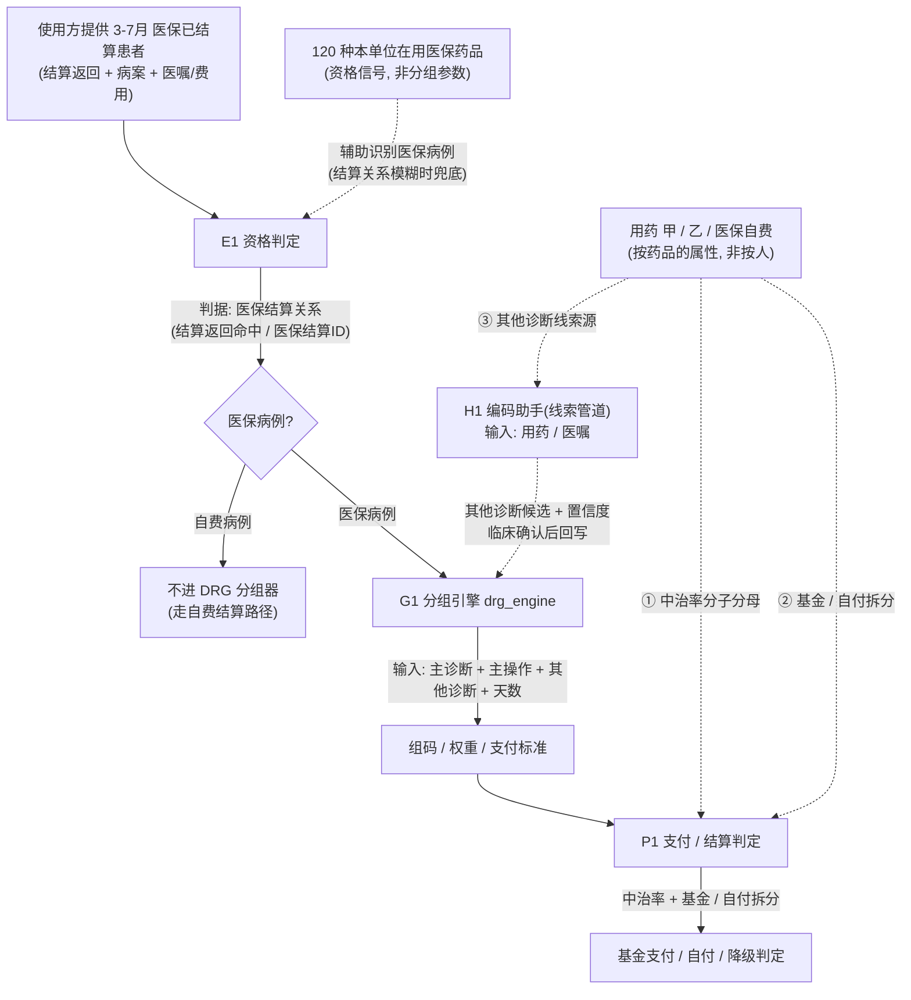
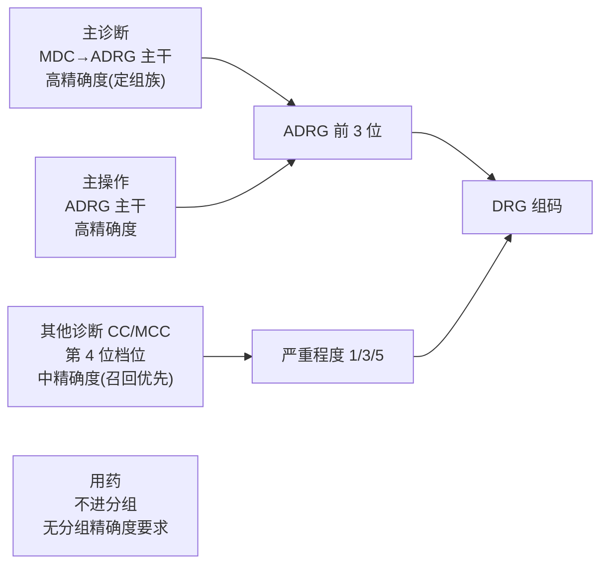

> 相关文档：需求汇总见《需求规格说明书》§3.1；功能汇总见《产品功能手册》§1；总索引见 README.md

# 分组器业务逻辑梳理与诊断影响入组的精确度边界

> 触发：一期分组引擎在"诊断如何影响入组"的边界上出现业务逻辑混乱，使用方描述的分组流程把资格/分组/支付三条管道串错、并把用药同时塞进三层。本文从需求分析与产品设计视角，对齐现有需求/设计文档，给出纠偏后的业务模型与"诊断精确度边界"的明确划分。
> 数据范围：**3–7 月（5 个月）医保已结算患者**（由使用方提供，较此前 3–5 月 N 例回测基线扩展）。
> 结论落地形态：本文是后续 `s06` 模拟器、`s14` 编码助手、`s20` 回归门槛的输入契约。

---

## 一、问题定位：业务逻辑混乱的根因

使用方描述的分组流程（简化）：

> 费用大类=医保/自费 → 先排除自费 → 按用药把患者分为甲/乙/医保自费 → 只有"医保用药"患者才进 DRG → 其他诊断随住院期间用药增删 → 诊断影响入组的精确度边界不清。

该流程把**三条本应独立的管道**错误地串成一条因果链，并把"用药"同时塞进三层：

| 被混淆的管道 | 正确职责 | 串错后的后果 |
|---|---|---|
| **资格管道**（自费 / 医保） | 决定"病例进不进 DRG 分组器" | 把"用药"当资格门槛 → 漏判"用了自费药但实际医保结算"或"医保病例但几乎无药"的病例 |
| **分组管道**（诊断 + 操作） | 决定"进哪个组、第几位" | 把"用药→其他诊断"当成分组输入 → 分组边界无法锚定 |
| **支付管道**（甲乙类 / 中治率 / 基金拆分） | 决定"基金付多少、自付多少、是否降级" | 与资格/分组纠缠 → 同一份用药数据被三处重复解释 |

代码侧事实（`src/etl/drg_engine.py`）：`DrgEngine.group()` 的入参只有 `main_dx / ops / other_dx / tcm_classes / days`，**完全不含用药**；用药既不进标准分组（`StandardGrouper.group`，`drg_engine.py:191`），也不进中医优势病组（`TcmGrouper.group`，`drg_engine.py:237`）。这从实现上印证：**用药不是分组输入**。

---

## 二、纠偏后的三管道解耦模型

**三条管道的核心契约**：

- **E1 资格**：输出"医保病例 / 自费病例"，判据是**医保结算关系**，不是用药。
- **G1 分组**：输入只有诊断 + 操作 + 天数，输出组码/权重/支付标准，不含用药。
- **P1 支付**：输入费用大类 + 甲乙类/医保自费 + 中治率，输出基金/自付拆分与降级判定。
- **H1 线索**：输入用药/医嘱，输出其他诊断候选，**仅作提示、禁止直接写码**，经临床确认后回写 G1。

---

## 三、E1 资格判定：医保结算关系为主，120 种医保用药为资格信号

### 3.1 主判据（权威）

- **医保病例** = 在医保结算返回中命中、或存在医保结算 ID 的住院病例 → 进 DRG 分组器。
- **自费病例** = 无医保结算关系（全自费、不走医保 DRG 结算）→ **不进 DRG 分组器**。

> 这与 `docs/14 §1.3` 一致：基金/自付拆分以"结算返回自带拆分字段"为准，原 `源表(settle_bill)` 四列填充率 0% 已停用。判定资格应回归"结算返回/医保结算 ID"这一权威源。

### 3.2 120 种医保用药 = 资格信号（使用方确认口径）

- **定位**：120 种本单位在用医保目录内药品清单，是**识别医保病例的辅助信号**，不是分组参数、也不是支付口径。
- **使用方式**：当某病例的结算关系字段缺失/模糊时，若其住院用药命中这 120 种中的至少一种，作为"更可能是医保病例"的兜底判据。
- **边界**：
  - 不能反向成立——"用了这 120 种药"≠"医保病例"（自费患者也可能用了医保目录内药品只是自掏腰包）；
  - 不能替代主判据——"是医保病例"也不要求"必须用了这 120 种药"（纯理疗/中医操作病例可能 0 药仍是 DRG 病例）。
- **待落实**：需给出 120 种清单的来源表（建议来自药品字典 ∩ 医保目录），并与"医保结算关系"主判据做一致性勾稽，冲突时以主判据为准。

---

## 四、G1 分组管道：引擎实际输入（不含用药）

由 `drg_engine.py` 实现，双路径（`docs/19 §二`）：

1. **中医优势病组**（某地区医保局〔2025〕27 号，属地叠加，先判）：主诊断 ∈ 清单 ∧ 住院天数 ≥ N ∧ 操作类覆盖条件（`TcmGrouper.group`，`drg_engine.py:237`）。
2. **标准 CHS-DRG 2.0**：主诊断 → MDC → ADRG（外科/操作条件优先）→ 其他诊断 ∩ MCC/CC → 第 4 位 → 权重 × 费率 × 系数（`StandardGrouper.group`，`drg_engine.py:191`）。

**关键事实**：分组函数入参中**不存在用药字段**。任何"用药影响分组"的说法，都只能经 H1 线索管道转成"其他诊断候选"后再进入 G1，且须临床确认。

---

## 五、P1 支付管道：用药的正确位置

用药（甲 / 乙 / 医保自费）在此管道发挥作用，**不进入分组**：

| 用药用途 | 说明 | 依据 |
|---|---|---|
| 中治率分子分母 | 中医优势病组结算前置硬条件（≥60% 否则降级内科组） | `docs/12 §五`、`docs/16 §2` |
| 基金 / 自付拆分 | 结算返回自带字段（甲类/乙类/统筹/自付等） | `docs/14 §1.3` |
| 其他诊断线索源 | 见 H1 | `docs/10 §三·补2 A.1` |

> **概念纠偏**：甲/乙/医保自费是**按药品**的报销属性，不是**按人**的"患者医保分类"。一个患者会同时用三类药，不存在"该患者是甲类"这种患者级分类。把它当患者级分类去"判断能否进 DRG"是双层错误。

---

## 六、H1 线索管道：用药 → 其他诊断（增删）→ 合并症（CC/MCC）判断

- **完整因果链（正确且为 DRG 严重度本貌）**：住院期间用药 / 医嘱 → **直接驱动其他诊断的增删** → 其他诊断参与**合并症/并发症（CC/MCC）判断** → 决定第 4 位严重程度档位。这与 `drg_engine.py:160 severity()` 完全同构。
- 输入：住院期间用药 / 医嘱（如降糖药、降压药、抗骨质疏松药等特征药品）。
- 输出：候选其他诊断（CC/MCC 漏报检测），带置信度（`docs/10 §三·补2 A.1`、`docs/21` 编码助手 R2）。
- 硬约束（`docs/10 §三·补2 C`）：
  1. **AI/规则永不直接写码或改码**，输出"候选 + 依据 + 置信度"，由医师/编码员确认后人工录入；
  2. **用药只能作为漏编线索，不能作为编码依据**（用了胰岛素 ≠ 糖尿病）；
  3. 分组判定只出自确定性规则引擎，AI 不参与。
- 落入 G1 前的状态必须是"临床已确认的已编码其他诊断"，引擎只吃 `other_dx` 入参。
- **"直接影响增删"的业务含义（须与系统边界区分）**：业务中"用药直接影响其他诊断增删"指**临床医师依据用药信息决定其他诊断的增删**（如见降糖药→补录糖尿病 E14.x），这是真实且合理的机制；但**系统侧**必须保持"候选 → 临床确认 → 已编码"的护栏——引擎 `severity()` 只消费已编码的 `other_dx`，绝不把用药当分组输入直接消费。两者不矛盾：用药通过"改变其他诊断"**间接**影响合并症档位，但用药本身**不进**分组函数（呼应 §三/§五"用药不参与分组"）。
- **落地实现**：该链已在 `src/etl/s14_coding_assistant.py` 的 **R2 规则**中实现——检测到特征用药而其他诊断缺失时，取该药对应的候选诊断前缀，对照 MCC/CC 表，并调用 `eng.std.severity()` **实算**"补录后第 4 位档位"的变化（不伴 → 伴一般 → 伴严重），写入提示的 `impact` 字段。全程只读引擎、绝不写码，仍走白名单 `W14` 闸门。

---

## 七、核心：诊断影响入组的精确度边界（分层 SLA）

把"诊断对分组的影响"按**作用层级**与**所需编码精确度**拆成两个正交维度：

| 输入 | 作用层级 | 改变什么 | 引擎字段 | 精确度 SLA |
|---|---|---|---|---|
| 主诊断 | MDC→ADRG 主干 | **整个病组家族（前 3 位）** | `main_dx` | **高**：ICD-10 医保版、在主诊表内、能唯一映射 ADRG。使用方确认主诊断几乎不变 → 是①行预分组的锚 |
| 主操作 | ADRG 主干（外科/操作组优先于内科） | 整个病组家族 | `ops` | **高**：须医保版操作码（国临↔医保对照，见 `docs/12 §3.1`） |
| 其他诊断（CC/MCC） | 严重程度档位（第 4 位） | **仅组内档位 1/3/5** | `other_dx` | **中（召回优先）**：只需落到 MCC/CC 表内且不被排除表取消（`drg_engine.py:160 severity()`） |
| 用药（甲/乙/医保自费） | 不进入分组 | — | 无 | 无分组精确度要求 |

**边界结论（本文核心）**：

1. **其他诊断的增删 → 合并症（CC/MCC）判断 → 只调"第 4 位档位"，绝不改 ADRG 前 3 位组族**。这就是"诊断影响入组精确度"的真实边界——它调的是档位，不是组族。用药正是经此链（用药→其他诊断→合并症）**间接**作用于分组，而非直接消费用药字段。
2. 一条其他诊断要真正改变档位，必须**同时满足**：①在 MCC/CC 表内 ②不被该码对应排除表对当前主诊断取消（`drg_engine.py:160` 的 `severity()` 已实现此布尔判定）。落在表外的其他诊断对分组**零影响**（只是编码条目）。
3. 精确度诉求在两层方向相反：**主诊断求"精确唯一"（防跨 MDC/落空）**；**其他诊断求"高召回"**（漏报 MCC 直接损失权重，如 `docs/12 §五` 单例差额 2,408 元）。
4. 用药→其他诊断→合并症是**间接链路**：用药驱动其他诊断的增删，其他诊断经临床确认后才进入引擎；引擎永远吃**已编码的 `other_dx`**，绝不直接吃用药。"用药影响合并症判断"与"用药不参与分组"两句话**同时成立**——前者的载体是"已编码的其他诊断"，后者的意思是"分组函数无用药入参"。这条边界是前文一切纠偏的落点。

### 草稿态 vs 终版态（避免误读"边界"）

在院阶段主诊断可能未录（`docs/19 §5.1` 暴露 42/120 缺主诊断）、其他诊断随用药动态——必须区分：

- **在院预分组**：基于当前已录信息（主诊断可能缺失、其他诊断为候选态）→ 模拟器①行须标注"基于当前已录信息"（对应白名单 `W17`）。
- **出院/结算终分组**：基于终版编码 → 与官方结算对表。

两者不一致是**正常**的，不应理解为"边界不清"，而应理解为"数据成熟度不同"。

---

## 八、数据范围扩展到 3–7 月的影响

- 回测/基线此前为 **3–5 月 N 例**（`docs/24` 回归门槛按 3–5 月沉降：ADRG ≥96.0% / 四位码 ≥81.3% / 样本量 ≥500）。
- **已落地（2026-09-24）**：结算返回已扩展为 **3–7 月 N 例**；`s20` 实测 **ADRG 96.9%（823/849）/ 四位码 88.1%（748/849）**，门槛**已重沉降为 ADRG ≥96.9% / 四位码 ≥88.1%**（运行 #11，见 `docs/24 §六`）；按月 ADRG 序列 3 月 95.6% / 4 月 98.0% / 5 月 98.2% / 6 月 96.6% / 7 月 96.2%。
- 仍待推进：
  1. 中治率逐月验证范围同步扩展（`docs/16 §2.3` 原 405 例口径扩展）；
  2. 资格信号 120 种药品清单随 6–7 月病例兜底识别做一致性勾稽。

---

## 九、待使用方确认项

| # | 事项 | 影响 | 责任方 |
|---|---|---|---|
| 1 | 120 种医保用药清单的来源表与勾稽口径（与"医保结算关系"主判据冲突时以谁为准） | E1 资格判定准确性 | 医务科 + 信息科 |
| 2 | 6–7 月医保结算返回是否到位，字段 schema 是否与前 3 月一致 | 扩展基线可行性 | 医务科 |
| 3 | 主诊断"几乎不变"的书面确认（用于①行锚定与在院/终版差异容差） | G1 预分组可信度 | 医务科 |
| 4 | 其他诊断"随用药动态增删"的确认边界：仅限已确认的医保病例（E1 通过） | H1 线索管道触发范围 | 医务科 |

---

## 十、与现有文档的衔接

- 本文是 `docs/10`（需求二次评估）中"入组条件与用药无关"结论的**业务模型展开**，建议 `docs/10` 新增"三管道解耦与诊断精确度 SLA"一节并引用本文。
- 分组双路径与引擎输入以 `docs/19` 为准；中治率硬条件以 `docs/12 §五`、`docs/16 §2` 为准；基金/自付拆分以 `docs/14 §1.3` 为准；合规闸门（禁止直接写码、中治率仅提示不诱导）以 `docs/26` 白名单/黑名单为准。
- 扩展后的回归门槛变更以 `docs/24`（`s20_regress.py`）为执行入口。
