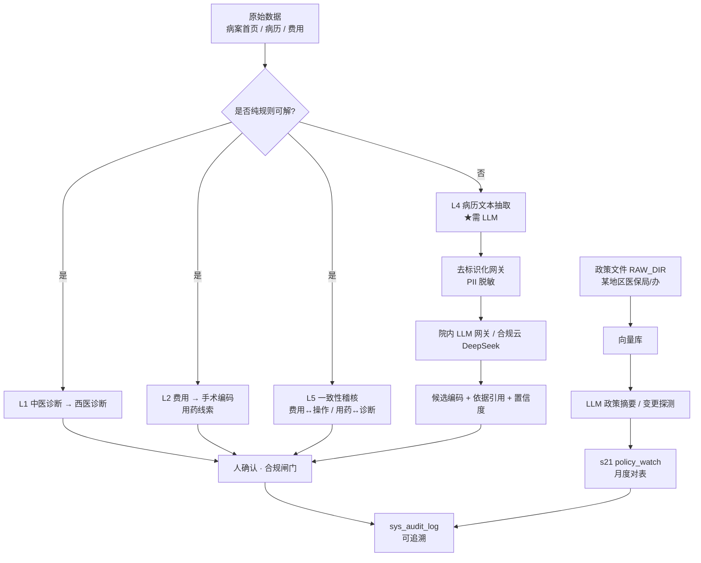

# docs/20 · AI 辅助编码可行性评估

> **文档状态**：补全。本文件被 `etl/s13_emr_probe.py` 与 `etl/s13b_probe_text.py` 以
> `Docs: docs/20-AI辅助编码可行性评估.md` 引用，但此前未落盘。本版据 S13/S13b 探针、
> `med_record` 实测、编码助手回测（`docs/21/22`）与使用方 AI 赋能选型综合成文。
>
> **关联文档**：`docs/08`（总体方案·AI 赋能路线）、`docs/11`（差异打样）、`docs/14`（对账盈亏）、
> `docs/21`（编码助手 v0 + 回测）、`docs/22`（首页操作码映射 + 平台收码发现）、`docs/26`（输出审议）。

---

## 0. 一句话结论

当前产品的「智能」**全部来自确定性规则引擎 + 统计回测**，**没有任何大模型 / LLM 调用**
（`etl/` 全仓无 openai/dashscope/zhipu/gpt 等调用；`BaseModel` 为 pydantic 误命中）。

AI 辅助编码的**数据条件已具备**（`med_record` 电子病历库当前账号可读、文本完整、与 HIS 出院病例
关联率 100%），但**LLM 文本抽取尚未实现**。建议落地顺序：**纯规则层（L1/L2/L5）先于 LLM 落地**，
LLM 仅用于真正的文本抽取（L4）与政策智能（RAG）。

---

## 1. 使用方 AI 赋能需求拆解

使用方选型与硬边界（见 `docs/08` v1.3）：

- **模型选型**：DeepSeek（使用方指定，云 API）+ 本地内网知识库 RAG。
- **去标识化网关强制**：原始病历默认**不出网**；所有外发文本先经脱敏。
- **AI 不判定分组**：模型只产出「候选编码 + 依据引用」，最终由人确认；分组结论以医保平台为准。
- **私有化降级路径**：DeepSeek 开放权重，可作院内私有化降级。
- **禁止清单**（对应 `docs/26` 黑名单 B01–B09）：不得诱导增加/减少诊疗、不得把盈亏当控费指令。

八角色审视要点：

| 角色 | 对 AI 赋能的审视结论 |
|---|---|
| 需求 | 「AI 补编码漏编/错编」= 一期规则交叉稽核 + 二期 LLM 文本抽取，需求成立且可验证 |
| 产品 | 工位展示「候选 + 置信度 + 原文引用」，不自动写码；与编码助手 R1–R5 共用出口 |
| 开发 | 规则层零新依赖；LLM 层需新增院内推理出口 + 去标识化网关 |
| 审计 | 所有 AI 建议须落 `sys_audit_log`，可回溯到「谁确认了哪条候选」 |
| 安全 | 原始病历不出网、PII 脱敏、AI 输出走合规闸门（失败即关闭） |
| 测试 | 回测量化检出率（docs/21/22 方法可复用） |
| 部署 | LLM 出口仅院内/合规云可达，不暴露公网 |
| 运维 | 模型调用失败降级为「仅规则」，不阻断业务 |

---

## 2. 现状能力矩阵（实测）

| 能力 | 实现方式 | 成熟度 | 实测证据 |
|---|---|---|---|
| 在院 DRG 模拟器 | `drg_engine` + `tcm_ratio` 规则推演 | ✅ 可运营 | `out/insim/s06_insim_2026-09-21.md`：117 在院 → 28 中医优势 / 48 标准 / 41 未产出，四行输出 |
| 编码助手 | 规则 R1–R5（反事实判据） | ⚠️ 半具备 | `docs/21/22`：N 例 R1∪R2 触发 74.1%，但 **R1 精度仅 ~1.5%** |
| AI 辅助编码可行性探针 | DB 探查，**未调模型** | ✅ 数据可行 | `s13/s13b`：`med_record` 可读、文本完整、关联 100% |
| 中医优势病组引擎 | 官方 PDF 规则抽取 + 校验 | ✅ 成熟 | `s04/s05`：194 诊断编码、中治率官方口径 |
| 盈亏看板 | SQL 聚合 + 公式 | ✅ 成熟 | `docs/14`：N 例回测，合计盈亏 672,050 元，中医组占 73.4% |
| 病历文本自动抽取诊断/操作编码 | **未实现** | 🔲 数据可行未实现 | `s13` 验证文本可读，但 `etl` 无 LLM 调用 |
| 智能问答 / 政策解读 / 自然语言交互 | **缺失** | ❌ | 无 LLM、无向量库、无 RAG |
| DRG 成本管控 | 🔲 部分 | — | 看板有「费用」缺「成本」维度（`docs/14` 已列下一步） |

> **诚实提示**：对外表述应区分「规则引擎」与「大模型 AI」。使用方若期望「AI 自动编码 / 智能问答」，
> 当前**未交付**，属路线图而非现状。

---

## 3. 数据条件核查（实测）

### 3.1 电子病历库 `med_record`（真实病历文本来源）

S13 探针结论（`etl/s13_emr_probe.py::probe_med_record`）：

- SBO 库内的 `病历` 表已废弃（24 行、停在 2018 年）；**实际病历在 `med_record` 库**，同一实例、当前账号**可读**。
- 文书 **23,955 份**，与 HIS 出院病例**关联率 100%**。
- 字段平均长度：**现病史 ~326 字、辅助检查 ~357 字、体格 ~429 字**（机器可读文本充足）。
- **西医其他诊断 + 编码分列**（CC/MCC 直接来源），可直接喂规则层。

### 3.2 编码填充率（按年拆，纠正全表误导）

| 口径 | 西医诊断 | 手术编码 | 编码员署名 |
|---|---|---|---|
| 全表（2015–2026） | 56.8% | 20.1% | 51.0% |
| **2026 年** | **96.7%** | **89.9%** | **88.9%** |

结论：低填充率被 2015–2020 年历史数据拖低，缺口属**历史性**；策略应由「补历史」改为
「守当期 ~10% 缺口」。

### 3.3 费用 → 编码线索

- `源表(fee_medicine_in).列(cost_name)` 为逐味中药饮片（如 *制川乌 / 杜仲 / 怀牛膝*），
  可作 L2 手术编码线索（用药 → 操作）。

### 3.4 一次失败尝试（前车之鉴）

- `med_record.源表(既有系统_predict__snapshot)` 是 2026-08-17 的**一次性失败尝试**：247 例几乎全
  「暂无诊断代码 → 未入组」，且 `surgery_code` 仍是未映射的院内码 `99.9201 毫针刺法`。
- 教训：直接套用未映射院内码 + 缺文本抽取，必然失败；必须先建映射表 + 文本层。

---

## 4. AI 赋能分层路线（L1–L5）

**落地优先级（ROI 由高到低）**：

1. **L1 / L2 / L5（纯规则，零新依赖，先做）** —— 复用 `drg_engine`/编码助手映射表，直接产出候选。
2. **R1 改造（先于任何新 AI 功能）** —— 先把现有规则做准（见 §6.2）。
3. **L4（LLM 文本抽取）** —— 仅本层需模型；经去标识化网关 + 院内推理出口。
4. **政策 RAG** —— `RAW_DIR` 建向量库，喂 `s21`，自动提示规则参数变更。

---

## 5. 合规与安全边界

- **输出审议闸门**：所有 AI 建议须经 `output_guard`（`docs/26`）：仅 `已确认` 白名单项可输出，
  **失败即关闭**（白名单不可读 → 受控输出全部抑制，记入 `suppressed_outputs`）。
- **去标识化网关强制**：原始病历默认不出网；外发文本先脱敏（对应 `s25` 敏感扫描 / `s26` 脱敏副本）。
- **AI 不判定分组**：模型只给候选 + 原文引用 + 置信度，最终由医师/编码员确认。
- **审计留痕**：每条 AI 候选的「采纳/驳回」写入 `sys_audit_log`（审计角色要求可追溯）。

---

## 6. 风险与诚实提示

### 6.1 规则引擎 ≠ 大模型 AI
当前对外可讲「规则引擎 + 统计回测」；「自动编码 / 智能问答」属二期，避免夸大交付范围。

### 6.2 编码助手 R1 精度问题（必须正视）
- R1 触发 394/N（71.4%），但**实际精度仅 ~1.5%**（450 触发对 7 确证）。
- 根因：`docs/22` 发现 **89.8%（354/394）的 R1 触发病例，官方本就把它们分入中医优势病组**，
  即「平台收到的编码 ≠ 病案首页所存的编码」（最可能来自**医保结算清单上传件**，另一份数据）。
- 影响：直接推「漏编」会误导医师。建议 R1 **重新定位为「编码自证不足提示」**，改为
  「反事实 + 与首页编码交叉校验」，仅作汇总统计与人工抽样入口，**暂缓上线**。

### 6.3 数据主权缺口（新 P0）
医院**无法用自有数据自查入组合规性**——需新增 P0：**索取医保结算清单上传件**，以对齐
平台收码与首页所存码。

### 6.4 LLM 引入代价
上 LLM 需新增：院内推理出口（或合规云）、去标识化网关、模型调用失败降级策略、调用量/成本可观测。
当前 IIS 部署（`docs/30`）无需 GPU/向量库；若上 LLM 须扩展该部署的出口与防火墙策略。

---

## 7. 落地里程碑（建议）

| 阶段 | 动作 | 产出 | 风险 |
|---|---|---|---|
| P0 | R1 改判据 + 索取结算清单上传件 | 规则精度收敛、`docs/22` 缺口闭环 | 低 |
| P1 | L1/L2/L5 规则候选上线（人确认） | 编码助手从「线索」到「候选」 | 低 |
| P2 | L4 LLM 文本抽取（去标识化网关 + 院内出口） | 主诊断/操作候选 + 依据引用 | 中（需模型出口合规） |
| P3 | 政策 RAG 接 `s21` | 政策变更自动提示 | 中 |

---

## 8. 证据索引

- `etl/s13_emr_probe.py` —— `med_record` 关联率/字段长度探针（第 10 行引用本文档）
- `etl/s13b_probe_text.py` —— 全实例文本定位（同引用）
- `docs/21-编码助手v0与量化回测.md` —— R1–R5 回测数字（以本文档 §6.2 更正版为准）
- `docs/22-首页操作码映射与平台收码发现.md` —— 首页码→操作类映射、平台收码 ≠ 首页码
- `docs/14-财务对账与盈亏看板.md` —— 盈亏口径与看板
- `docs/26-系统输出内容审议材料.md` —— 白/黑名单与 `output_guard` 闸门
- `docs/30-IIS部署配置.md` —— 生产部署（LLM 出口扩展见 §6.4）
