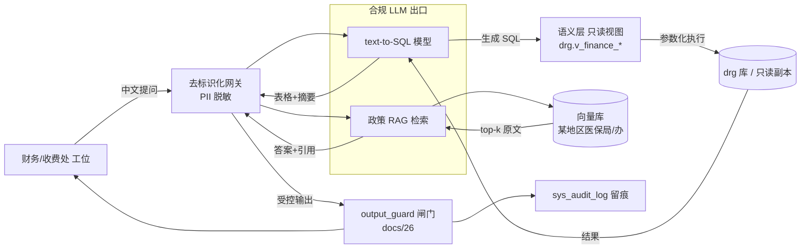

# docs/31 · AI 赋能·财务问数与政策问答场景设计

> **文档状态**：新增。承接 `docs/20`（AI 辅助编码可行性评估）的「使用方 AI 赋能需求场景」一节，
> 将使用方提出的三个具体场景落为可评审的设计。
>
> **关联文档**：`docs/20`（AI 可行性总评估）、`docs/08`（总体方案·AI 路线）、
> `docs/14`（财务对账盈亏）、`docs/26`（输出审议）、`docs/30`（IIS 部署）。
> **使用方选型基线**：DeepSeek（云 API）/ 本地 RAG；去标识化网关强制；AI 不判定分组。

---

## 0. 使用方场景摘要

| 编号 | 场景 | 提出方 | 是否需 LLM |
|---|---|---|---|
| S1 | 自然语言「问数」：财务/收费处用中文提问，自动生成并跑 SQL | 财务/收费处 | ✅ 需（text-to-SQL） |
| S2 | 政策问答：对某地区医保局/办文件提问，返回带原文引用的答案 | 财务/收费处 | ✅ 需（RAG） |
| S3 | 同 DRG 组费用差异归因 + 经管医师责任定位 | 财务/收费处 | ⚠️ 规则层可先做，LLM 增强解释 |
| 数据就绪 | 其他诊断判断（入院病情）已基本全部录入完成 | 使用方确认 | ✅ 已实测 **99.5%**，但**仅成立于 HIS 明细表**（见 §1.4） |

> **关键数据信号**：其他诊断适应症录入完成 → 差异归因可由「仅看金额」升级为
> 「CC/MCC（并发症/合并症）维度解释」，是 S3 能从黑盒走向可解释的前提。

---

## 1. 场景拆解与数据可行性（实测锚定）

### 1.1 S3 · 同组费用差异 + 医师归因（优先级最高，规则层可先行）

**分析维度**（均来自已确认字段）：

| 维度 | 来源 | 说明 |
|---|---|---|
| DRG 组 | 结算返回 / `drg` 库 `result_*`（ADRG/四位码） | 分组口径以医保平台为准 |
| 经管医师 | `源表(admission).列(doctor_residency)`（已确认=住院医师） | 责任定位主键 |
| 费用构成 | 费用明细（检查/治疗/药品三表，统计码 22 档：05 床位/07 护理/11 手术/13 材料/19 麻醉） | 差异结构拆解 |
| 住院天数 | 病案首页 | 强相关成本驱动 |
| CC/MCC | 其他诊断 `源表(diagnosis)`(列(order), 列(kind_diagnose)=2) + **适应症** | 差异归因核心（现已就绪） |

**差异归因逻辑**：同一 ADRG/四位码组内，患者成本差异主因通常为
① CC/MCC（并发症/合并症数量与严重度）② 住院天数 ③ 手术/操作 ④ 收费项目结构。
适应症录入完成后，① 可由「其他诊断码 + 适应症」映射到 CC/MCC，使解释成立。

**可行性结论**：S3 的「规则版」**不依赖 LLM** 即可交付——在 `drg` 库建只读视图，
前端做「选 DRG 组 → 看成本分布箱线 + 按医师拆分 + CC/MCC 构成」看板。LLM 仅用于
把「为什么这组 A 医师患者比 B 医师贵」转成自然语言小结（增强，非必需）。

### 1.2 S1 · text-to-SQL 问数

- **对象**：财务/收费处（角色见 `sys_role`）。
- **模式**：中文提问 → LLM 生成 SQL → 在**语义层只读视图**上执行 → 返回表格 + 自然语言摘要。
- **安全前提**（见 §4）：LLM **只能**落在白名单视图上，禁止跨库 DML/DDL，结果经 PII 脱敏。
- **为何必须建语义层**：直接让 LLM 写原始 HIS 表，字段歧义（如多个「金额」列、点分中医码）
  会导致幻觉 SQL。语义层把「患者/组/医师/费用/CC-MCC」预聚合成稳定 schema，text-to-SQL 才可靠。

### 1.3 S2 · 政策问答 RAG

- **语料**：`原始资料/官方下发文件/`（某地区医保局〔2025〕26/27 号、渝医保办〔2025〕50/51 号、
  CHS-DRG2.0 排除表、某地区细分组目录）、`原始资料/中医入组标准(1).xlsx`。
- **模式**：语料切片 → 向量库 → 提问召回 top-k → LLM 据原文生成答案 + **引用文件名与条款**。
- **价值**：自动提示规则参数变更，反哺 `s21 policy_watch`（月度对表）。

### 1.4 实测：50 例抽样验证「其他诊断判断」录入情况（S30）

> 脚本：`python src/etl/s30_dx_indication_sample.py --sample 50 --since 2026-03-01`
> 只读；`CHECKSUM` 确定性抽样，两次运行结果完全一致（可复现）。

| 指标 | 结果 |
|---|---|
| 样本 | 50 例出院病例（出院 ≥ 2026-03-01） |
| 有其他诊断（西医·终版）的病例 | **49/50** |
| 其他诊断条数（去重后） | **210 条** |
| `列(instatus)` 已填 | **209 条 = 99.5%** |
| 病例级 | 全填 **48** 例 / 部分填 **1** 例 / 全空 **0** 例 |

**结论**：使用方「已基本全部录入完成」的说法，在 **HIS 诊断明细表层面成立（99.5%）**。

**但三点必须澄清**：

1. **「适应症」不是独立列，而是自由文本** —— 已扫描 SBO / med_record / drg 全部列名，无任何列含「症」字；
   使用方所指的适应症存放于 **`源表(cost_medicare).列(memo)`**，格式为
   `适应症:…\r\n禁忌症:…`（实测原文示例见 §1.5）。而 `源表(diagnosis).列(instatus)` 是**另一回事**
   （语义 = 入院病情，取值 1 有 / 2 临床未确定 / 3 情况不明 / 4 无），两者不可混为一谈。
2. **病案首页层面结论相反** —— `med_record.源表(case_man).入院病情` 24,034 条中
   **24,031 条为「情况不明」**（99.99%），仅 3 条为「有」，即首页该字段**并未真正判断**、是默认值。
   而**上传医保的是首页/结算清单**，两侧不一致会使 CC/MCC 归因失真
   （与 `docs/22`「平台收码 ≠ 首页所存码」属同类问题）。
3. **口径教训（差一点误判）** —— `列(kind_input)` 3(出院) 与 4(终版) 是近乎重复的快照；
   若直接用 `IN (3,4)` 统计会重复计数，填充率被误算为 **82.0%**（406 条 / 333 已填），
   几乎得出「使用方说法不成立」的错误结论。必须「终版优先 + 按 (病例, 列(order)) 去重」。

### 1.5 实测：药品适应症/禁忌录入核查（`源表(cost_medicare).列(memo)`）

> 脚本：`python src/etl/s30_dx_indication_sample.py --file src/sql/adhoc/10_medicine_indication_coverage.sql`
> 缺口清单：`src/sql/adhoc/09_medicine_indication_gap.sql`（只读；明细留存 `out/coding/medicine_indication_gap.csv`）

**范围**（使用方口径）：`源表(medicine_dict)` 中 `列(mark_open)=1`、`列(sort_code)<>'03'`、
`列(sort_kind)<>'卫生材'`、`列(pharmacy)='1080'`、`列(stock_number)<>0` 的在售药品。

| 缺失情况 | 药品数 | 占比 |
|---|---|---|
| 完整（同时含「适应症」与「禁忌」） | **118** | **98.3%** |
| 整条为空 | 2 | 1.7% |
| 缺适应症 / 缺禁忌症 / 两者皆无 | 0 | 0% |

**结论**：使用方「适应症已基本全部录入完成」的说法，在**药房 1080 在售药品**口径下**属实（98.3%）**。

> ⚠ **口径警示**：98.3% **不等于**「住院实际用药品目」的覆盖率。实测 2026-06-01 起住院医嘱
> 用到 **770 个品目**，仅 **57 个（7.4%）** 有适应症说明；其中药品类 420 个品目仅 57 个有（13.6%），
> 而占绝对多数的**中草药饮片 360 个品目为 0%**。详见 **§1.8**。

**仅剩 2 个缺口**（均可直接补齐）：

| 收费编码 | 药品名 | 分类 | 医保等级 |
|---|---|---|---|
| W02000110241487 | 灭菌注射用水 | 西药针 | **乙类** |
| N09114010233367 | 止痛消炎软膏 | 中成药 | 自费 |

> 风险排序：**灭菌注射用水（乙类）优先** —— 属医保报销药品，适应症/禁忌缺失会在
> 「合理用药 / 适应症用药」审核中形成举证缺口；止痛消炎软膏为自费，风险次之。

**方法论备注**：`列(memo)` 全表仅 34,031/259,580 行非空（13.1%）、1,571 个去重值，
属**医保目录说明文本**而非每例数据——故「适应症录入」是**字典级**工作，
与「每例其他诊断是否判断」是两件事，不能互相替代。

#### 最终口径（使用方 2026-09-23 确认）

> 使用方确认：**03 类（中草药饮片）不在适应症录入范围内**；且 120 个品目中
> **仅甲类 / 乙类属医保报销，其余为医保自费**。据此精算：

| 医保等级 | 品目数 | 适应症+禁忌完整 | 完成度 |
|---|---|---|---|
| 甲类 | 81 | 81 | **100%** |
| 乙类 | 33 | 32 | 97.0% |
| 自费 | 6 | 5 | 83.3% |
| **合计** | **120** | **118** | 98.3% |
| **医保报销范围（甲+乙）** | **114** | **113** | **99.1%** |

**定稿结论**：
- **医保报销药品（甲类 81 + 乙类 33 = 114 个）适应症/禁忌完成度 = 113/114 = 99.1%**
  → 使用方「适应症已基本全部录入完成」的说法**在医保报销口径下成立**。
- **唯一真实合规缺口：灭菌注射用水（乙类）** —— 属医保报销药品，缺失会在
  「合理用药 / 适应症用药」审核中形成举证缺口，**建议优先补录**。
- 止痛消炎软膏为**自费**，不在医保报销范围，优先级可下调（不影响医保合规）。

### 1.6 病程 / 医嘱数据源地图（实测，S31）

> 脚本：`python src/etl/s31_course_probe.py --pull 50 --since 2026-03-01`（只读，复用 S30 同一批样本）
> 单例原文：`--dump <住院号>`；病案名称分布：`--dist`

**使用方指引的取数位置**：病程表看「病案名称」→ 首次病程记录 / 入院记录，取既往史、现病史；
医师用药在**首次病程记录 + 长期医嘱 + 临时医嘱**。实测定位如下：

| 用途 | 库.表 | 关键列 | 近期 50 例覆盖 |
|---|---|---|---|
| 入院记录（现病史 / 既往史 / 西医其他诊断+编码） | `med_record.dbo.源表(med_record)` | `住院号`, `现病史`, `既往史`, `西医其他诊断`, `西医其他诊断_疾病编码` | **94.0%**（四项子字段均 92.0%） |
| **首次病程记录** | `med_record.dbo.hospital_course_record` | `病案名称='首次病程记录'`, `病案内容`, `记录医生`, `书写时间` | **98.0%**（中位 **4,888** 字，最大 6,515） |
| 长期医嘱 | `SBO.dbo.源表(advice_long)` | `列(hospital_no)`, **`列(cost_note)`**, `列(cost_item)` | **98.0%** |
| 临时医嘱 | `SBO.dbo.源表(advice_temp)` | 同上（含中草药**逐味饮片 + 剂量**） | **98.0%** |

**文本体量**：现病史中位 **321** 字（最大 459）、既往史中位 **144** 字、首次病程记录中位 **4,888** 字。
现病史 321 字与 `docs/20` 记录的 ~326 字互相印证。

**⚠ 命名陷阱（易取错列）**：医嘱表中 **`列(cost_note)` 才是项目名**（如 `注射用七叶皂苷钠【10mg*1支】`、
`中药贴敷`）；`列(cost_item)`（西药针 / 治疗费 / 中草药）与 `列(cost_kind)` 仅是**类别**，不是药名。

**全局 vs 近期（重要）**：`hospital_course_record` 全表 235,356 行，其中「首次病程记录」13,459 条，
对 23,976 住院例 ≈ **56%**——但**近期样本覆盖率达 98%**。即首次病程记录的缺口属**历史性**，
近期数据可放心用于 AI 抽取（与 `docs/21`「按年拆开看」的教训一致）。

**病案名称 top5**：日常病程记录 122,441 / 主治医师查房记录 28,112 / 副主任医师查房记录 19,037 /
**首次病程记录 13,459** / 出院证 13,331。

**实测样例（住院号 20260672）** —— 首次病程记录原文已含完整既往史，可直接作为「其他诊断判断」的依据：
> 既往史：前列腺增生病史 10 余年（曾 3 次手术）；肺结节病史多年；1 年前诊断腔隙性脑梗死、
> 格林-巴利综合征、低钾血症、高尿酸血症、右下肢静脉血栓……

对应临时医嘱中草药为**逐味饮片 + 剂量**：制草乌 3 / 白土苓 30 / 威灵仙 30 / 鸡血藤 30 / 黄芪 30 /
薏苡仁 30 / 白芍 20 / 牛膝 10 / 秦艽 10 / 桂枝 10……（可作「用药 ↔ 诊断」交叉稽核的线索源）。

### 1.7 结算返回（平台回执）比对 —— 上传源判定（实测）

> 脚本：`src/sql/adhoc/12_settle_return_vs_his.sql`（只读）
> 口径：结算清单 = **医保每月返回的出院患者结算报销单**，含住院天数、主要诊断、其它诊断、主要手术、其它手术。

**库内落点**：`drg.dbo.result_settlement_return`，字段为
`main_diag_code / other_diag_codes / main_op_code / other_op_codes / actual_days`
（后两者为 `|` 分隔的**多码列表**，注：非 `main_diag`，取数勿写错列名）。

**实测填充（按月）**：

| 月份 | 例数 | 主要诊断 | 其它诊断 | 主要手术 | 其它手术 | 住院天数 |
|---|---|---|---|---|---|---|
| **3 月** | 185 | **185** | **185** | **184** | **182** | 185 |
| 4 月 | 200 | 0 | 0 | 0 | 0 | 0 |
| 5 月(Sheet1) | 167 | 0 | 0 | 0 | 0 | 0 |
| 6 月 | 175 | 0 | 0 | 0 | 0 | 1 |
| 7 月 | 132 | 0 | 0 | 0 | 0 | 0 |

> **只有 3 月这批（185 例）回执了诊断/手术；4 月起医保不再回显这些字段**。

**3 月返回的编码体量**：其它手术码**中位 4 个**（68.6% 的例 ≥3 个，最多 6 个），其它诊断码 2–7 个。
而病案首页 `手术编码` **每例只有 1 个**（`docs/22`：655/655）——首页**结构上装不下**多码。

**三方比对（3 月 185 例，主诊断）**：

| 比对对象 | 一致例数 | 一致率 |
|---|---|---|
| HIS 诊断明细表 `源表(diagnosis)`（终版 列(order)=1 西医） | **152/185** | **82.2%** |
| 病案首页 `源表(case_man).西医诊断_疾病编码` | 137/185 | 74.1% |

**结论（闭环 `docs/22` 悬置项）**：
1. **上传源是 HIS 诊断/手术明细表，不是扁平化的病案首页** —— 首页为单槽结构，无法产生 2–7 个其它诊断码
   与最多 6 个其它手术码；且返回与 HIS 明细的一致率（82.2%）高于首页（74.1%）。
2. 因此**「其他诊断判断」的上传口径取 `列(instatus)`（入院病情，HIS 明细 99.5%），而非首页的 99.99%「情况不明」**
   → **CC/MCC 归因成立**，S3 可推进。
3. **首页「入院病情」99.99% 为「情况不明」仍属首页质控缺陷**，虽不直接影响上传口径，但应作为质控项修复。

**残余风险**：
- 主诊断仍有 **17.8% 不一致**（152/185），可能来自编码员改写、上传件覆盖或修正诊断时点差异，需抽样人工核对。
- **4 月起医保不再回显诊断/手术** → 失去持续自查能力，仍需向医保索取**上传件副本或平台导出**，
  `docs/22` 的该项 P0 由"完全阻塞"降级为"用于覆盖 4 月及以后"。

### 1.8 「药品适应症 → 判断在院患者其他诊断增删」可行性裁定（实测）

**问题**：结算返回与「用药品适应症判断在院患者其他诊断增删」是同一件事吗？该链路可行吗？

#### (1) 两者不是同一件事 —— 阶段不同，只有校验关系

| | 结算返回（结算单） | 在院其他诊断增删 |
|---|---|---|
| 时点 | **事后**（出院结算后次月返回） | **事中**（患者住院期间） |
| 性质 | 医保回执 / 汇总结果 | 院内实时判断 |
| 能否用于判断在院患者 | ❌ 不能（人已出院；且 4 月起不回显明细） | — |
| 用途 | **回测尺子**：验证规则准确率 | 实际业务动作 |

唯一关系是**校验**：用医保实际采纳的诊断/手术码，回测「增删建议规则」的准确率。
且该尺子**正在失效**（§1.7：4 月起诊断/手术列全空）。

> 使用方「结算单是汇总结果，只能通过患者信息逆推明细」的判断**成立**——这正是 §1.7 的做法
> （`medical_no ↔ 列(hospital_no)` 回连 HIS）。补充实测：3 月那批确实回执了诊断/手术多码（185 例），
> **4 月起全空**，故「汇总 + 需逆推」对 4 月及以后完全成立。

#### (2) 药品适应症这条链路，在本单位**数据基础不成立**

实测（2026-06-01 起住院医嘱实际用药）：

| 类别 | 实际用药品目 | 有适应症 | 覆盖 |
|---|---|---|---|
| **中草药（饮片）** | **360** | **0** | **0%** |
| 西药针 | 33 | 32 | 97% |
| 西药片 | 19 | 18 | 95% |
| 中成药 | 5 | 4 | 80% |
| 精神药 / 外用药 | 3 | 3 | 100% |
| **合计（药品类）** | **420** | **57** | **13.6%** |
| 含治疗/检查/材料等全部品目 | 770 | 57 | **7.4%** |

**裁定**：本单位为中医医院，用药以**中草药饮片为主（360/420 = 86%）**，而**饮片无一有适应症说明**。
故药品适应症仅能覆盖 **14% 的用药（西药）**，且西药多为对症处理（止痛、脱水、护胃），
对「其他诊断增删」的信息量有限 → **不能作为主依据**。

另：适应症是**自由文本而非编码**（如「用于补充能量和体液；用于低糖血症…」），
要映射到 ICD 诊断码须先建「适应症文本 → 候选诊断」映射，当前尚无。

#### (3) 正确路径：以病历文本为主依据，用药降级为交叉线索

| 依据 | 近期 50 例覆盖 | 说明 |
|---|---|---|
| **首次病程记录** | **98.0%**（中位 4,888 字） | 既往史直接写明并发症（实测：前列腺增生、肺结节、腔隙性脑梗死、格林-巴利、低钾血症、高尿酸血症、右下肢静脉血栓） |
| 入院记录 现病史 / 既往史 | 92.0%（321 / 144 字） | 同上 |
| 药品适应症 | **13.6%** | 仅作**交叉线索**，不作依据 |

> 中医场景下「饮片 → 西医诊断」本身也不成立：饮片对应的是**中医证型 / 治则**，不是 ICD。
> 若要走用药路线，正确映射目标是**证型（Z 类码）**而非西医诊断。

#### (4) 合规红线（不可逾越）

- 规则 / AI 只能提示「可能漏编」或「依据不足」，**不得自动增删诊断**；
- **严禁为入组或权重增删诊断**（黑名单 B01–B09 明令禁止诱导增加 / 减少诊疗）；
- **用药不作为编码依据**（`docs/20` 已定：用药仅作线索）；
- 任何增删建议必须可回溯到**病历原文引用 + 置信度**，由医师 / 编码员确认。

### 1.9 医保用药范围边界：03 类（中草药饮片）是否应纳入？（待使用方裁定）

**使用方口径**：`源表(medicine_dict)` 中 `列(pharmacy)='1080'` + 在售 + 有库存 + `列(sort_code)<>'03'` +
非卫生材 = **120 个品目**，即"医保用药、医保才报销"的范围；其适应症/禁忌完成度 **98.3%**（§1.5）。

**实测：03 = 中草药（饮片/颗粒），且是本单位最大的医保报销药类**

| 分类码 | 含义 | 医保甲/乙类品目 | 在售有库存 | 有适应症 |
|---|---|---|---|---|
| 01 | 西药 | 702 | 119 | 107 |
| 02 | — | 81 | 6 | 6 |
| **03** | **中草药（饮片/颗粒）** | **934**（其中**甲类 932**） | **475** | **0** |
| 13 | — | 2 | 1 | 0 |
| **合计** | | **1,719** | **601** | **288（16.8%）** |

- 实际住院开出的 **360 味饮片全部属于 03**，且在药品字典中可查、但**无一有适应症说明**。
- 按「医保甲乙类 + 在售有库存」全口径，适应症完成度 = **113/601 = 18.8%**；
  仅按「非 03」口径 = **113/126 ≈ 89.7%**（用户原查询口径含自费项，故为 98.3%）。

**结论**：**98.3% 只在「排除中草药饮片」的前提下成立**。03 类饮片 92%（932/1,013）为**医保甲类**，
属可报销范围，却无一条适应症说明。

**✅ 使用方裁定（2026-09-23）：03 类中草药饮片【不在】适应症录入范围内**
（饮片按辨证论治使用，医保目录不给饮片设"限定支付范围"，排除 03 正确）。

**并进一步明确**：120 个品目中**仅甲/乙类属医保报销，其余为医保自费**
→ 最终按「医保报销范围（甲+乙）= 114 个品目」计，完成度 **99.1%**（见 §1.5 最终口径）。

**与 DRG 的关系**：DRG 计算的是走医保报销患者的费用，饮片费用计入**总费用**并计入**中治率分子**
（`docs/16` 中治率科目映射 775 条中医项目）——故饮片即便无适应症说明，其费用**仍进 DRG 结算**。

### 1.10 L5 一致性稽核已落地（S32，纯规则 / 零 LLM）

> 作业：`src/etl/s32_dx_audit.py`
> ```
> python src/etl/s32_dx_audit.py --build-dict --since 2026-03-01 --top 60   # 生成词典
> python src/etl/s32_dx_audit.py --audit --since 2026-03-01 --limit 300     # 跑稽核
> ```
> 产出：`src/out/coding/s32_dx_audit.csv`（逐条线索 + 原文片段）、`s32_dx_audit.md`（汇总）

**做法**：词典**从本单位自己的编码历史中生成**（`源表(diagnosis)` 其他诊断的 `列(note)` + `列(icd)`，
取频数 Top N 并按诊断名去重）→ **不凭空造 ICD 码**。再对每个病例把「入院记录既往史+现病史 +
首次病程记录」正文与已编码的其他诊断做双向比对。

**实测结果（300 例出院病例，出院 ≥ 2026-03-01）**：

| 项 | 数量 |
|---|---|
| 词典条目 | 56 |
| 有病历文本的病例 | 300 / 300 |
| **疑似漏编线索** | **75 条 / 67 例**（占 22.3% 病例） |
| 其中剔除否定表述 | 723 次命中 |
| 依据不足（内部统计） | 179 条 |
| 被合规闸门抑制 | 0 条（全部经 W07 放行） |

线索构成：骨质疏松 46、高血压 6、糖尿病 5、骶管囊肿 4、冠心病 3、完全性右束支传导阻滞 2、
尺骨茎突骨折 2、慢性胃炎 1、高尿酸血症 1 等。抽检 5 条骨质疏松原文**均为真实记载**
（影像报告或临床表述，如"患者因骨质疏松长期后天不足导致肝肾亏虚…"）。

**开发中发现并修复的 5 个真实缺陷**（回测量化）：

| 缺陷 | 影响 | 修复后 |
|---|---|---|
| 否定表述未剔除（"否认高血压、糖尿病、冠心病"） | 线索 1376 条，大量误报 | 剔除 723 次 |
| 同名多码重复计数（高血压病 I10.x00x002 / I10.x00x021） | 同一发现重复报 | 词典按名去重 |
| 主诊断未排除（腰椎/颈椎间盘突出症常为主诊断） | 误报为"漏编其他诊断" | 106 → 75 |
| 去方位词后左右侧矛盾（左侧 ← 双侧） | 侧别错误线索 | 方位冲突判定 |
| 「除外」未纳入否定词（"请除外高血压性心脏病"） | 明确排除仍报 | 补入否定词表 |

> ⚠ 运行注意：不要用 `Select-Object -First N` 截断脚本输出——PowerShell 会**提前终止管道并杀掉进程**，
> 导致脚本未跑完、CSV 仍为上一次结果（本次实测踩过）。

**合规设计（红线）**：
- 输出文本统一经 `output_guard` 白名单 **W07**（今日由示例医务丁签认为「已确认」）放行，
  措辞为"请病案编码员核对是否应纳入填报（仅提示核对，**不建议补写不存在的诊断**）"；
- **反向「依据不足」179 条不输出** —— 无白名单条目，且提示某诊断"缺乏依据"易被读成删除建议
  （黑名单 B09），只作编码员内部统计；
- 不自动写码、不以入组/权重为导向。

**已知局限（待改进）**：
1. 词典仅覆盖历史高频其他诊断（56 条），罕见合并症查不出；
2. 部分线索来自**影像报告描述**（如"…骨质增生骨质疏松"）而非临床诊断表述，是否编码需编码员判断；
3. 未接入 CC/MCC 排除表，无法判断该诊断是否真的影响分组（W07 二期目标）；
4. 中文分词未做，长诊断名（含节段如 L2/3-L5/S1）靠包含匹配，召回有限。

---

## 2. 架构



---

## 3. 语义层视图设计（草案）

> 以下视图建在 `drg` 库，只读，供 S1/S3 共用；表名以实际 `drg` 库字典为准。

**`v_finance_patient_cost`**（患者级成本事实表）
| 列 | 含义 |
|---|---|
| 列(hospital_no) | 住院号（脱敏键） |
| drg_group | 四位码（缺口行标 NULL） |
| adrg | ADRG |
| doctor_residency | 经管医师（来自 `源表(admission).列(doctor_residency)`） |
| total_cost | 总费用（费用明细 列(money)>0 合计，剔除退费负数，见 `docs/14`） |
| cost_bed/cost_nurse/cost_surg/cost_mat/cost_ane | 床位/护理/手术/材料/麻醉 |
| los | 住院天数 |
| cc_cnt / mcc_cnt | 其他诊断中 CC/MCC 计数（依赖适应症映射） |

**`v_finance_group_variance`**（组级方差，S3 核心）
| 列 | 含义 |
|---|---|
| drg_group | 四位码 |
| 列(patients) | 例数 |
| cost_mean / cost_median / cost_p50 / cost_p90 | 统计量 |
| cost_iqr | 四分位距（差异幅度） |
| top_driver | 组内差异主因（CC/MCC / LOS / 手术，规则判定） |

**`v_policy_doc`**（政策问答语料索引，供 RAG 切片）

---

## 4. 合规与安全（等保 / 隐私 / 审计）

| 控制点 | 要求 |
|---|---|
| 只读 | text-to-SQL **仅**在语义层视图执行；语句白名单（SELECT + 限定表），拒绝 DML/DDL/跨库 |
| 角色守卫 | 财务/收费处可见**聚合**；**个体医师级成本归因**需 `docs/26` 白名单授权，默认仅医务科/院领导可见（等保个人信息） |
| PII 脱敏 | 住院号/姓名经 `s25`/`s26` 脱敏后出网；去标识化网关强制 |
| 输出闸门 | 所有 AI 回答经 `output_guard`，失败即关闭，记入 `suppressed_outputs` |
| 审计 | 每条问数/答案 + 执行 SQL + 采纳情况写入 `sys_audit_log` |
| LLM 出口 | 仅院内/合规云可达（扩展 `docs/30` 防火墙策略），原始病历默认不出网 |

---

## 5. 风险

1. **text-to-SQL 幻觉**：LLM 可能生成错误 SQL → 必须约束语义层 + 执行前语法/表白名单校验 + 结果人工复核开关。
2. **医师归因敏感**：「哪位医师患者更贵」涉医务人员绩效与隐私，等保下需明确授权范围，避免变相「医师排名」引发合规问题。
3. **两个「适应症」概念不可混用，且首页侧仍存疑**：
   - 药品适应症（`列(memo)`）已实测 **98.3%** 完整（§1.5），仅 2 个缺口，风险可控；
   - 其他诊断的**入院病情**（`列(instatus)`）HIS 明细表 99.5%（§1.4），但**病案首页同名字段 99.99% 为「情况不明」**。
     若结算清单上传取首页字段，CC/MCC 归因仍会失真——须先确认上传来源，再定归因口径。
4. **LLM 出口合规**：DeepSeek 云 API 须确认数据不出域或走私有化降级（见 `docs/08`）。

---

## 6. 落地优先级

| 阶段 | 动作 | 依赖 |
|---|---|---|
| P0 | 语义层视图 + S3 规则版看板（同组差异 + 医师拆分 + CC/MCC 构成） | 无 LLM，可立即做 |
| P1 | S1 text-to-SQL（LLM 网关 + 语义层 + 执行校验） | P0 视图、LLM 出口 |
| P2 | S2 政策 RAG（向量库 + 语料授权入库） | 语料授权 |
| P3 | S3 自然语言解释增强 | P1 |

---

## 7. 待使用方确认

1. **医师级成本归因的可见范围**：财务/收费处是否可直接看个体医师？还是仅聚合到组/科室？（决定角色守卫粒度）
2. **政策问答语料授权**：某地区医保局/办文件是否全量授权入库建向量？（涉版权与内网分发）
3. **LLM 出口选型**：DeepSeek 合规云 vs 院内私有化（决定部署与防火墙改造量）
4. ✅ ~~上传源是 HIS 明细表还是病案首页~~ —— **已判定（§1.7）**：结算返回与 HIS 明细一致率 82.2% > 首页 74.1%，
   且首页为单槽结构装不下返回中的多码 → **上传源 = HIS 明细表**，CC/MCC 归因成立。
   **剩余待办**：① 主诊断 17.8% 不一致需抽样核对；② 4 月起医保不再回显诊断/手术，
   需索取上传件副本以覆盖 4 月及以后

---

## 8. 证据索引

- `docs/20-AI辅助编码可行性评估.md` —— AI 可行性总评估、分层路线、合规边界
- `docs/14-财务对账与盈亏看板.md` —— 费用口径（列(money)>0 合计、剔除退费）
- `docs/26-系统输出内容审议材料.md` —— 白/黑名单与 `output_guard` 闸门
- `docs/08-改造升级总体方案.md` —— 使用方 AI 选型（DeepSeek/RAG/去标识化网关）
- `docs/30-IIS部署配置.md` —— 生产部署（LLM 出口扩展见 §4）
- 字段事实：`源表(admission).列(doctor_residency)`（经管医师，已确认）、`源表(diagnosis)`（其他诊断）、费用明细统计码 22 档
